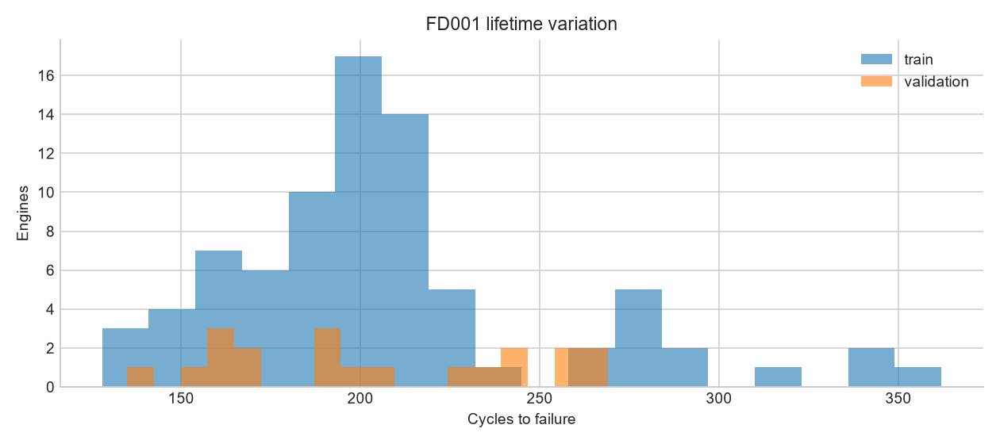
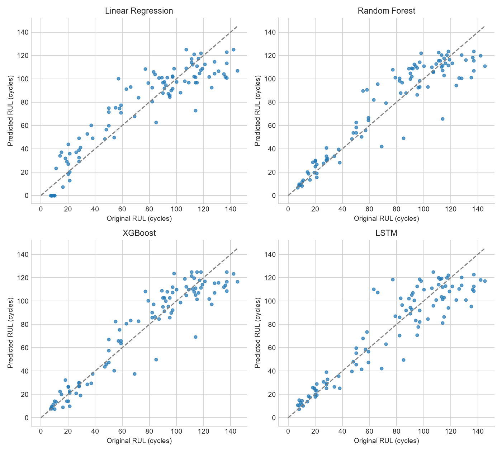
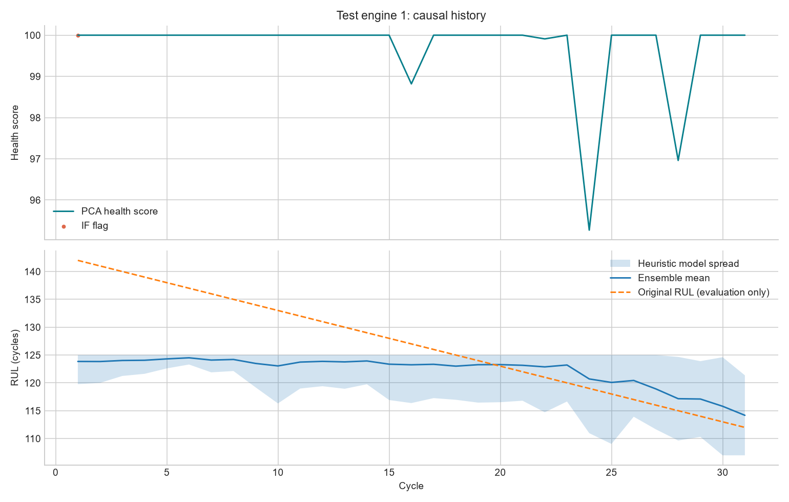

# FD001 · Aircraft engine health and remaining life

A reproducible portfolio research project for a GE Aerospace Data Science internship application. Built on NASA's simulated turbofan degradation data. This is an independent project, not a GE product or an operational maintenance system.

## Recorded experiment

This README is generated by `src/reporting.py` from recorded artifacts, not manually entered metrics. Run completed 2026-09-07T15:27:40.943096+00:00. Partition sizes: 80 fitting engines / 20 validation engines / 100 official test engines. Seed: 42. Window: 30 cycles. Target ceiling: 125 cycles. Device: cpu. Total pipeline time before report rendering: 183.20 seconds. Full settings, package versions, source hashes and split IDs are saved in `config.json`, `reports/run_manifest.json`, and `artifacts/split_manifest.json`.

FD001 is the single-operating-condition, single-HPC-degradation subset. NASA supplies separate run-to-failure training trajectories and censored test trajectories. Data sources: [NASA dataset record](https://catalog.data.gov/dataset/cmapss-jet-engine-simulated-data), [official archive](https://data.nasa.gov/docs/legacy/CMAPSSData.zip). Citation: A. Saxena and K. Goebel, Turbofan Engine Degradation Simulation Data Set, NASA Ames Prognostics Data Repository (2008). The official archive's README and modeling paper are included in `data/raw/`.

## Run locally

Use Python 3.12.4. From this repository directory:

```powershell
uv venv --python 3.12 .venv
uv pip install --python .venv/Scripts/python.exe -r requirements.lock.txt
# Data and trained artifacts are included. To fetch a fresh official copy:
.venv/Scripts/python.exe scripts/download_data.py
.venv/Scripts/python.exe -m src.pipeline
.venv/Scripts/python.exe -m pytest -q
.venv/Scripts/python.exe -m streamlit run dashboard/app.py
```

On macOS/Linux use `.venv/bin/python` instead. `requirements.txt` pins direct dependencies; `requirements.lock.txt` records the complete Windows environment used for this result. The platform-specific lock may need re-resolution on other operating systems. The pipeline is CPU-bounded and intentionally runs one LSTM. Re-running overwrites generated artifacts; preserve a copy to compare experiments. Model files are trusted local Python artifacts and should only be loaded from trusted sources.

## Data and EDA

Every source column is documented in [the data dictionary](data/README.md). Sensor numbers are the authoritative source identities; sensor symbols and units are transcribed from Table 2 of NASA's bundled modeling paper. [Sensor evidence table](reports/sensor_analysis.csv) includes variance, cycle/RUL correlations, within-engine rank correlation, monotonicity, trend strength, noise proxy, slope variation, initial variation, decisions and reasons. Retained sensors: sensor_2, sensor_3, sensor_4, sensor_7, sensor_8, sensor_9, sensor_11, sensor_12, sensor_13, sensor_14, sensor_15, sensor_17, sensor_20, sensor_21. The Normalize action applies to each Keep sensor and is fitted on training engines only.



See [EDA reasoning](reports/01_data_eda.md) and [per-engine degradation and starting-condition evidence](reports/engine_sensor_analysis.csv). HI uses one standardized PCA component with recorded explained variance ratio 0.640413; see [exact learned loadings and anchors](reports/health_indicator.json).

## Honest evaluation

No engine crosses fitting and validation partitions. Official test IDs occupy a separate namespace. Selection uses synthetic censored validation endpoints; all test engines are evaluated at their final observed cycle. Classical models receive last/mean/std/slope summaries of the same sensor history consumed by the LSTM. Scaler, sensor policy, PCA and anomaly detector never fit on validation/test measurements. Training losses weight engines equally. See [target, split and window rationale](reports/02_targets_split.md).

Validation endpoints, capped target:

| model | MAE | RMSE | R2 |
| --- | --- | --- | --- |
| Linear Regression | 14.8274 | 17.5344 | 0.6524 |
| Random Forest | 13.7889 | 18.2093 | 0.6251 |
| XGBoost | 12.8682 | 17.1451 | 0.6677 |
| LSTM | 12.6713 | 15.1456 | 0.7407 |
| Ensemble mean | 12.3484 | 15.8030 | 0.7177 |

Official test endpoints, capped target:

| model | MAE | RMSE | R2 |
| --- | --- | --- | --- |
| Linear Regression | 12.3542 | 15.1461 | 0.8571 |
| Random Forest | 9.8507 | 13.7442 | 0.8824 |
| XGBoost | 9.1169 | 12.3532 | 0.9050 |
| LSTM | 10.5498 | 14.3275 | 0.8722 |
| Ensemble mean | 9.2612 | 12.4092 | 0.9041 |

Official test endpoints, ORIGINAL NASA RUL (same bounded predictions):

| model | MAE | RMSE | R2 |
| --- | --- | --- | --- |
| Linear Regression | 13.4242 | 16.5422 | 0.8415 |
| Random Forest | 10.9207 | 15.0578 | 0.8687 |
| XGBoost | 10.1869 | 13.5960 | 0.8930 |
| LSTM | 11.6198 | 15.6662 | 0.8579 |
| Ensemble mean | 10.3312 | 13.8783 | 0.8885 |

The capped task reflects limited early-life identifiability but underestimates life above the ceiling. Both tables are necessary; they are different target definitions and should not be mixed when comparing papers. MAE/RMSE units are cycles; R2 is dimensionless. [Full metrics](reports/metrics.csv) include train/validation/test and engine-weighted all-cycle results. Training all-cycle errors are in-sample diagnostics. Adjacent-cycle errors are dependent; the primary test has one prediction per engine.

The LSTM does not beat XGBoost on capped test RMSE in this run. This experiment does not justify choosing the LSTM for its added complexity. Measured XGBoost-minus-LSTM RMSE difference: -1.9744 cycles; paired engine bootstrap interval (2000 resamples): [-4.3965, 0.2676]. Selected XGBoost fit: 2.00 seconds (candidate search 5.22 seconds); LSTM training including validation: 38.62 seconds, 13489 parameters, best epoch 20 of 30 run. Timing scopes differ and are stated rather than presented as a controlled benchmark. See `reports/lstm_xgb_comparison.json`, `reports/training_cost.json` and `reports/model_selection.csv`.

The lowest validation RMSE belongs to LSTM; the lowest official test RMSE belongs to XGBoost. Rankings on a small, synthetically censored validation partition need not transfer to test engines. The test comparison is descriptive, not a new round of model selection.



## Health, anomalies and uncertainty

PCA health is anchored to the early/terminal training medians and clipped to the score domain. It is a relative score and can fluctuate. Isolation Forest compares sensor-window statistics with an early-life fitting reference. No anomaly-label accuracy is claimed. The uncertainty display is equal-model mean +/- 1.96 sample standard deviations, bounded by the target ceiling. It is a heuristic spread interval, not a calibrated interval or a coverage guarantee.

Measured official test endpoint interval diagnostics:

| target | coverage | mean_width |
| --- | --- | --- |
| rul_target | 0.7000 | 25.3382 |
| rul_raw | 0.6800 | 25.3382 |

Coverage is an observed fraction, not a nominal confidence level. Correlated models can agree and still be wrong. [Uncertainty reasoning](reports/06_uncertainty.md) details the limitations.

## Explainability and dashboard

The UI uses a navy control sidebar and three tabs: Overview, Sensor trends, and Explainability. It includes causal RUL history, model comparison bars, readable sensor names, a training-standardized display toggle, and observation/SHAP CSV downloads. See [UI design notes](reports/09_ui_design.md).

Run the Streamlit command above, choose a test engine and observed cycle, and inspect health, RUL/spread, sensor trends, anomaly status and top signed SHAP contributors. XGBoost SHAP explains its raw output before clipping; the app shows its baseline and reconstructed prediction. [Global sensor importance](reports/shap_global.csv) and [local endpoint explanations](reports/shap_sensor_contributions.csv) are exported. These are model attributions, not causal fault diagnoses.

Project-defined status uses the lower heuristic RUL bound: Red below 20, Orange below 40, Yellow below 80, Green otherwise. Thresholds are illustrative values in `config.json`, not real aerospace limits. They are shown in the UI and never represented as learned safety thresholds.



## Interview walkthrough and repository

`notebooks/01_fd001_walkthrough.ipynb` contains executed artifact inspection with figures and decision notes. `reports/01_*.md` through `08_*.md` explain each major step. `data/` holds source files, provenance and column documentation; `src/` holds the modular pipeline; `dashboard/app.py` is the single Streamlit app; `artifacts/` contains fitted state; `reports/` contains auditable predictions, metrics and figures; `tests/` checks targets, causal windows, split isolation, artifact consistency and dashboard interactions.

Reproducibility limits: one seed and one held-out validation partition; synthetic validation censoring; bounded, unequal hyperparameter-search budgets; correlated sliding windows; simulated data under a single regime; heuristic interval; no labeled anomaly truth. Bootstrap intervals describe held-out-engine sampling variation only. No test-driven retuning was performed. `scripts/refresh_evaluation.py` can recompute metrics and reports from saved predictions without fitting; `reports/evaluation_refresh.json`, when present, records that audit and its source hashes. Constant-target R2 is undefined and left blank rather than forced to zero.

## Roadmap / Phase 2 — not implemented

- FD002/FD004: extend the loader/split namespace and add operating-condition normalization in `preprocessing.py`.
- Real-flight-condition NASA dataset: add a separate data adapter and condition-aware evaluation; do not reuse FD001 assumptions.
- Temporal CNN/Transformer: extend the model registry in `rul_models.py` with the same window/evaluation contract.
- Quantile regression, MC dropout or conformal prediction: replace `evaluation.ensemble_spread`, add appropriate training/calibration partitions and retain interval diagnostics.
- FastAPI: expose the existing prefix-inference contract as a service.
- Docker: package the pinned runtime and trained artifacts.
- Live-replay simulation: feed observed prefixes into the existing inference path.
